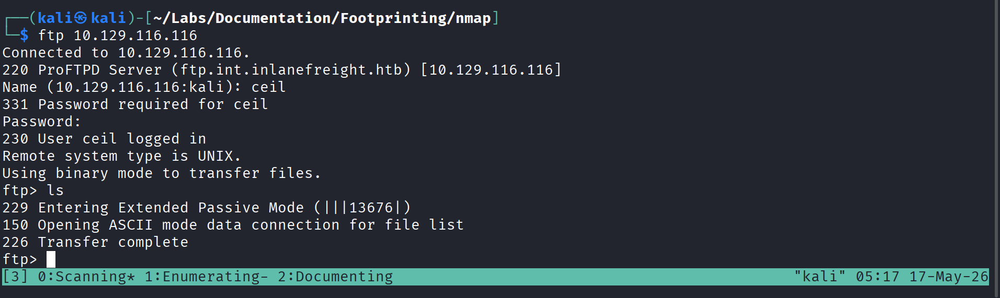
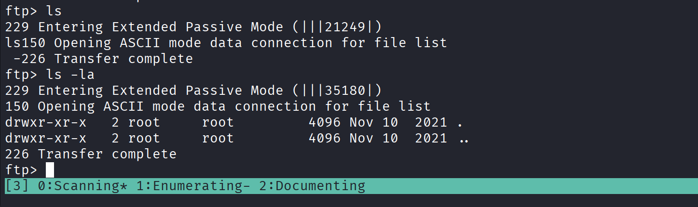
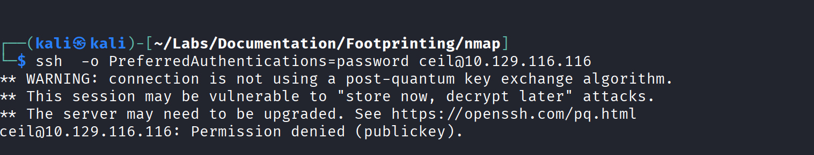
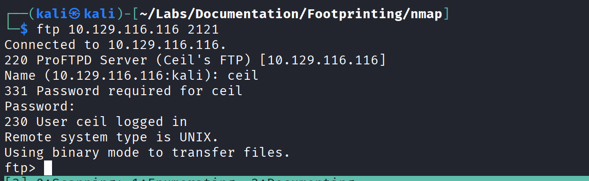
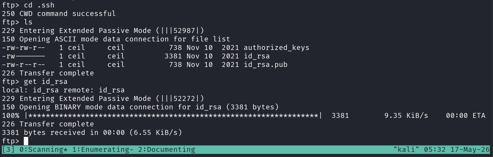
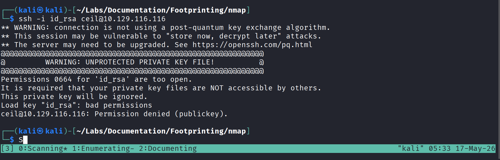
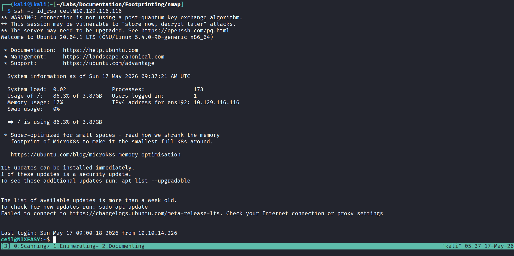
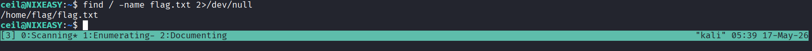
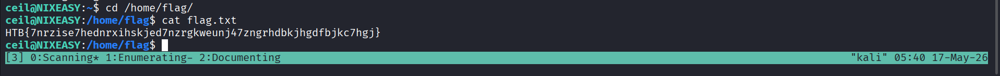

## Summary:
- We are commissioned to test three different **server**.
- First internal DNS server.
- Our teammates found a cred on some forums websites, Because their employees talking about, Creds:"ceil:qwer1234"
- And also we are only able to do stealth scanning because company infrastructure are in production.
- Our goal is to find as much as information are present, And find a file named flag.txt


### Scanning

#### First Scan
```Bash
┌──(kali㉿kali)-[~/Labs/Documentation/Footprinting/nmap]
└─$ nmap 10.129.116.116 -Pn -sCV
Starting Nmap 7.99 ( https://nmap.org ) at 2026-05-17 04:45 -0400
Stats: 0:01:29 elapsed; 0 hosts completed (1 up), 1 undergoing Script Scan
NSE Timing: About 75.00% done; ETC: 04:47 (0:00:06 remaining)
Nmap scan report for 10.129.116.116
Host is up (0.15s latency).
Not shown: 996 closed tcp ports (reset)
PORT     STATE SERVICE VERSION
21/tcp   open  ftp     ProFTPD
22/tcp   open  ssh     OpenSSH 8.2p1 Ubuntu 4ubuntu0.2 (Ubuntu Linux; protocol 2.0)
| ssh-hostkey: 
|   3072 3f:4c:8f:10:f1:ae:be:cd:31:24:7c:a1:4e:ab:84:6d (RSA)
|   256 7b:30:37:67:50:b9:ad:91:c0:8f:f7:02:78:3b:7c:02 (ECDSA)
|_  256 88:9e:0e:07:fe:ca:d0:5c:60:ab:cf:10:99:cd:6c:a7 (ED25519)
53/tcp   open  domain  ISC BIND 9.16.1 (Ubuntu Linux)
| dns-nsid: 
|_  bind.version: 9.16.1-Ubuntu
2121/tcp open  ftp     ProFTPD
Service Info: OS: Linux; CPE: cpe:/o:linux:linux_kernel

Service detection performed. Please report any incorrect results at https://nmap.org/submit/ .
Nmap done: 1 IP address (1 host up) scanned in 148.18 seconds

```
- Here Three TCP ports are open.
Then now i am trying to access ftp port of 21 using found creds, 



Here We are able to access ftp server, But one problem is there is not file or directory are there here.

Also i am trying to check hidden files

But also there isn't any file are there here.

Then i will try to access ssh service using those creds. Because that credential also is for ssh, Now lets check 


Nope, Its not connecting using passwords.

Now lets check using option called `-o PreferredAuthentications=password`


Nope, Here also its not accepting with password.

Now earlier while doing nmap scan we found 3 ports, the third port are also ftp port which are running on non-standard port that is 2121. Now lets check to connect with this port


Hurray!!!, We logged in using ftp port 2121 with those creds.

Now lets check is there any file or directories are there or not.


Yes there are some hidden directories or files present.

Now we are seeing here .ssh directory which is accessible by us, that is user ceil after going inside that directory i able to get private key of ssh 


Now we may able to get access of server using ssh.


We are not able to get access here also using private key because ssh dont allow access without proper permission in that private key file, we have to change permission of `id_rsa` file 


We have to set only permission to user and remove all the permission from other and group users.


Now here we get access of that server using ssh .
Now we can find flag.txt file 



After going into that directory we able to find that flag.



This lab is very useful that teaches my how to enumerate services and find a way to exploit them.
