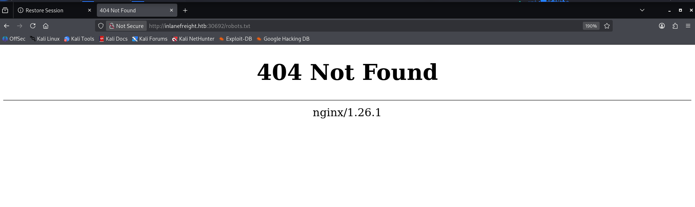

In this writeup we are going to a lab of module `Information Gathering - Web Edition`.

## Overview
This writeup documents my approach to solving the HTB academy Information Gathering - Web Edition Skills Assessment.

## Objective:
- Use information gathering techniques like `whois`, analysing `robots.txt`
- Performing subdomain bruteforcing
- Crawling and analysing results
And we have to add sub-domains in our host file

## Q1:What is the IANA ID of the registrar of the inlanefreight.com domain?

**Command:**
```Bash
whois inlanefreight.com
```

**Output:**
```Bash
Domain Name: INLANEFREIGHT.COM                                                                            
   Registry Domain ID: 2420436757_DOMAIN_COM-VRSN                                                              
   Registrar WHOIS Server: whois.registrar.amazon                                                              
   Registrar URL: http://registrar.amazon.com                                                                  
   Updated Date: 2026-05-13T08:57:09Z                                                                          
   Creation Date: 2019-08-05T22:43:09Z                                                                         
   Registry Expiry Date: 2026-08-05T22:43:09Z                                                                  
   Registrar: Amazon Registrar, Inc.                                                                           
   Registrar IANA ID: <Redacted>                                                                                      
   Registrar Abuse Contact Email: trustandsafety@support.aws.com                                               
   Registrar Abuse Contact Phone: +1.2024422253                                                                
   Domain Status: clientTransferProhibited https://icann.org/epp#clientTransferProhibited                      
   Name Server: NS-1303.AWSDNS-34.ORG 
```

## Q2:What http server software is powering the `inlanefreight.htb` site on the target system? Respond with the name of the software, not the version, e.g., Apache.


To do this question we have to add this `inlanefreight.htb` host name `/etc/hosts` file
**Command:**
```Bash
curl -i http://inlanefreight.htb:30692
```

**Output:**
```Bash
HTTP/1.1 200 OK
Server: <Redacted>/1.26.1
Date: Fri, 29 May 2026 12:50:44 GMT
Content-Type: text/html
Content-Length: 120
Last-Modified: Thu, 01 Aug 2024 09:35:23 GMT
Connection: keep-alive
ETag: "66ab56db-78"
Accept-Ranges: bytes

<!DOCTYPE html><html><head><title>inlanefreight</title></head><body><h1>Welcome to inlanefreight.htb</h1></body></html>
```

## Q3:What is the API key in the hidden admin directory that you have discovered on the target system?

- lets check first `robots.txt` file on `inlanefreight.htb` site:
	 

	- Here we didn't find robots.txt file
- Lets crawl this `inlanefreight.htb` website using `ReconSpider`:

	**Command:**
```Bash
	python3 ReconSpider.py http://inlanefreight.htb:30692
```

**output:**
```Bash
{
    "emails": [],
    "links": [],
    "external_files": [],
    "js_files": [],
    "form_fields": [],
    "images": [],
    "videos": [],
    "audio": [],
    "comments": []
}
```

- Here we also didn't find anything, lets try to enumerate `inlanefreight.htb` its directory using `gobuster`
- **Command:**
```Bash
  gobuster dir -u http://inlanefreight.htb:30692 -w ~/Wordlist/subDomains/subdomains-top1million-110000.txt -t 100
  ```
- **Output:**
```Bash
  ===============================================================
Gobuster v3.8.2
by OJ Reeves (@TheColonial) & Christian Mehlmauer (@firefart)
===============================================================
[+] Url:                     http://inlanefreight.htb:30692
[+] Method:                  GET
[+] Threads:                 100
[+] Wordlist:                /home/kali/Wordlist/subDomains/subdomains-top1million-110000.txt
[+] Negative Status codes:   404
[+] User Agent:              gobuster/3.8.2
[+] Timeout:                 10s
===============================================================
Starting gobuster in directory enumeration mode
===============================================================
Progress: 110000 / 110000 (100.00%)
===============================================================
Finished
===============================================================
```
- Here we also didn't able to find anything.


Now lets try `vhost` discovery using gobuster 
**Command:**
```Bash
gobuster vhost -u http://inlanefreight.htb:30692 -w ~/Wordlist/subDomains/subdomains-top1million-110000.txt -t 100 --append-domain
```
- Lets analyze `vhost` of this `inlanefreight.htb` using gobuster:
```Bash
===============================================================
Gobuster v3.8.2
by OJ Reeves (@TheColonial) & Christian Mehlmauer (@firefart)
===============================================================
[+] Url:                       http://inlanefreight.htb:30792
[+] Method:                    GET
[+] Threads:                   200
[+] Wordlist:                  /usr/share/wordlists/seclists/Discovery/DNS/subdomains-top1million-110000.txt
[+] User Agent:                gobuster/3.8.2
[+] Timeout:                   10s
[+] Append Domain:             true
[+] Exclude Hostname Length:   false
===============================================================
Starting gobuster in VHOST enumeration mode
===============================================================
#www.inlanefreight.htb:30792 Status: 400 [Size: 157]
#mail.inlanefreight.htb:30792 Status: 400 [Size: 157]
#smtp.inlanefreight.htb:30792 Status: 400 [Size: 157]
#pop3.inlanefreight.htb:30792 Status: 400 [Size: 157]
web1337.inlanefreight.htb:30792 Status: 200 [Size: 104]
Progress: 114442 / 114442 (100.00%)
===============================================================
Finished
===============================================================
```

here we found out an `vhost` named `web1337.inlanefreight.htb`

Lets add this `vhost` in `/etc/hosts` file to get access of this file

After adding this in `/etc/hosts` file lets check out this service on http port
![[Skills Assessment-20260529200359646.png]]
Yes we can now access this domain. 

Now lets check robots.txt to get more information.
	![[Skills Assessment-20260529200505157.png]]
Here we can see an interesting directory revealed `/admin_hidd3n`

Lets see is this directory giving response or not:

**Command:**
```Bash
curl -I http://web1337.inlanefreight.htb:30792/admin_h1dd3n
```

**Output:**
```Bash
HTTP/1.1 301 Moved Permanently
Server: nginx/1.26.1
Date: Fri, 29 May 2026 14:47:40 GMT
Content-Type: text/html
Content-Length: 169
Location: http://web1337.inlanefreight.htb/admin_h1dd3n/
Connection: keep-alive
```
Here we can see that it is giving response but on different location

Lets enumerate directory using `gobuster`:

**Command:**
```Bash
gobuster dir -u http://web1337.inlanefreight.htb:30792/admin_h1dd3n -w /usr/share/dirb/wordlists/common.txt
```

**Output:**
```Bash
Gobuster v3.8.2
by OJ Reeves (@TheColonial) & Christian Mehlmauer (@firefart)
===============================================================
[+] Url:                     http://web1337.inlanefreight.htb:30792/admin_h1dd3n
[+] Method:                  GET
[+] Threads:                 10
[+] Wordlist:                /usr/share/dirb/wordlists/common.txt
[+] Negative Status codes:   404
[+] User Agent:              gobuster/3.8.2
[+] Timeout:                 10s
===============================================================
Starting gobuster in directory enumeration mode
===============================================================
index.html           (Status: 200) [Size: 255]
Progress: 4613 / 4613 (100.00%)
===============================================================
Finished
===============================================================
```

Here we also get an `index.html` sub-directory of `/admin_h1dd3n`

Lets see `index.html` 
![[Skills Assessment-20260529202825772.png]]
Here we can see the API key.

## **Q4&Q5:After crawling the `inlanefreight.htb` domain on the target system, what is the email address you have found? Respond with the full email, e.g., mail@inlanefreight.htb.**

Let's try to crawl this website using `ReconSpider` tool

**Command:**
```Bash
python3 Reconspider.py http://web1337.inlanefreight.htb:30743/index.html
```

**Output:**
```Bash
{
    "emails": [],
    "links": [],
    "external_files": [],
    "js_files": [],
    "form_fields": [],
    "images": [],
    "videos": [],
    "audio": [],
    "comments": []
}
```
Nope here we also didn't find anything here, lets try to enumerate its sub directory using `gobuster`.

**Command:**
```Bash
gobuster dir -u http://web1337.inlanefreight.htb:30743 -w /usr/share/seclists/Discovery/DNS/subdomains-top1million-110000.txt
```

**Output:**
```Bash
┌──(reconvenv)(kali㉿kali)-[~/Tools/Footprinting]
└─$ gobuster dir -u http://web1337.inlanefreight.htb:30743 -w /usr/share/seclists/Discovery/DNS/subdomains-top1million-110000.txt 
===============================================================
Gobuster v3.8.2
by OJ Reeves (@TheColonial) & Christian Mehlmauer (@firefart)
===============================================================
[+] Url:                     http://web1337.inlanefreight.htb:30743
[+] Method:                  GET
[+] Threads:                 10
[+] Wordlist:                /usr/share/seclists/Discovery/DNS/subdomains-top1million-110000.txt
[+] Negative Status codes:   404
[+] User Agent:              gobuster/3.8.2
[+] Timeout:                 10s
===============================================================
Starting gobuster in directory enumeration mode
===============================================================
Progress: 114442 / 114442 (100.00%)
===============================================================
Finished

```
here also didn't get anything.

Lets scan directory or subdomain with `gobuster` to `inlanefreight.htb` because question mentioned `inlanefreight.htb`

**Command:**
```Bash
gobuster dir -u http://inlanefreight.htb:30743 -w /usr/share/seclists/Discovery/DNS/subdomains-top1million-110000.txt -t 100
```

**Output:**
```Bash
===============================================================
Gobuster v3.8.2
by OJ Reeves (@TheColonial) & Christian Mehlmauer (@firefart)
===============================================================
[+] Url:                     http://inlanefreight.htb:30743
[+] Method:                  GET
[+] Threads:                 100
[+] Wordlist:                /usr/share/seclists/Discovery/DNS/subdomains-top1million-110000.txt
[+] Negative Status codes:   404
[+] User Agent:              gobuster/3.8.2
[+] Timeout:                 10s
===============================================================
Starting gobuster in directory enumeration mode
===============================================================
Progress: 114442 / 114442 (100.00%)
===============================================================
Finished
===============================================================

```
Here we also get anything.

lets try to enumerate `sub-domain/vhost` of `web1337.inlanefreight.htb` using gobuster.
**Command:**
```Bash
gobuster vhost -u http://web1337.inlanefreight.htb:30743 -w /usr/share/seclists/Discovery/DNS/subdomains-top1million-110000.txt --append-domain -t 100
```

**Output:**
```Bash
===============================================================
Gobuster v3.8.2
by OJ Reeves (@TheColonial) & Christian Mehlmauer (@firefart)
===============================================================
[+] Url:                       http://web1337.inlanefreight.htb:30743
[+] Method:                    GET
[+] Threads:                   100
[+] Wordlist:                  /usr/share/seclists/Discovery/DNS/subdomains-top1million-110000.txt
[+] User Agent:                gobuster/3.8.2
[+] Timeout:                   10s
[+] Append Domain:             true
[+] Exclude Hostname Length:   false
===============================================================
Starting gobuster in VHOST enumeration mode
===============================================================
dev.web1337.inlanefreight.htb:30743 Status: 200 [Size: 123]
#www.web1337.inlanefreight.htb:30743 Status: 400 [Size: 157]
#mail.web1337.inlanefreight.htb:30743 Status: 400 [Size: 157]
#smtp.web1337.inlanefreight.htb:30743 Status: 400 [Size: 157]
#pop3.web1337.inlanefreight.htb:30743 Status: 400 [Size: 157]
Progress: 114442 / 114442 (100.00%)
===============================================================
Finished
===============================================================
```

Now we get a `vhost` which is now we can access.

Now try to analyze this domain. But I have to add that domain into `/etc/hosts` file to get access because it is a `vhost` using a same IP and running on the same server.

![[Skills Assessment-20260530215157601.png]]
ok lets analyze this using domain using `ReconSpider.py` tool.

**Command:**
```Bash
python3 ReconSpider.py http://dev.web1337.inlanefreight.htb:30743
```

**Output:**
```Bash
{
    "emails": [
        "<Redacted>"
    ],
    "links": [
        "http://dev.web1337.inlanefreight.htb:30743/index-291.html",
	    .
	    <snip>
	    <snip>
	    <snip>
	    .
        ,
        "http://dev.web1337.inlanefreight.htb:30743/index-202.html"
    ],
    "external_files": [],
    "js_files": [],
    "form_fields": [],
    "images": [],
    "videos": [],
    "audio": [],
    "comments": [
        "<!-- Remember to change the API key to <Redacted> -->"
    ]
}

```

Here we got an email for question number 4 as well as a bonus the answer for question 5 also in the comment section.

Then we don't need to do anything for question no 5.

## Conclusion

In this lab, I performed multiple information-gathering techniques against the target environment and successfully answered all assessment questions. The exercise demonstrated how seemingly small pieces of information can be combined to discover hidden resources and sensitive data.

### Key Findings

* Identified the registrar IANA ID using WHOIS enumeration.
* Determined the web server software through HTTP header analysis.
* Discovered a hidden administrative directory by analyzing robots.txt.
* Found an API key within the hidden admin directory.
* Enumerated virtual hosts and discovered `web1337.inlanefreight.htb`.
* Performed further VHOST enumeration and discovered `dev.web1337.inlanefreight.htb`.
* Used ReconSpider to crawl the development site and extract an email address and HTML comments containing sensitive information.

### Tools Used

* whois
* curl
* gobuster
* ReconSpider
* robots.txt analysis
* DNS/VHOST enumeration techniques

### Lessons Learned

* VHOST enumeration can reveal hidden applications that are not accessible through the main website.
* robots.txt may expose sensitive directories and should always be reviewed during reconnaissance.
* Crawling tools can discover information that directory brute-forcing alone may miss.
* Development environments often contain sensitive information such as API keys, email addresses, and comments left by developers.
* A structured enumeration methodology is more important than relying on a single tool.

### Mistakes Made

* Initially focused too much on directory enumeration instead of investigating newly discovered virtual hosts.
* Did not immediately analyze crawler results in detail.
* Spent time brute-forcing paths that were not relevant to the assessment objectives.

### Next Steps

* Practice advanced VHOST enumeration techniques using FFUF and Gobuster.
* Improve web crawling methodology with tools such as GoSpider and Katana.
* Continue developing a repeatable reconnaissance workflow for future HTB and penetration-testing engagements.

